Bedwars
=======

[](https://github.com/Filiprogrammer/Bedwars/actions/workflows/main.yml)

Highly customizable Bedwars plugin for Paper 1.17.1 - 1.21.4

Features
--------

* User friendly arena setup process
* Sophisticated game world system (Every game runs in a temporary copy of the original world)
* Customizable game states with various actions
  * Destroy/replace all beds
  * Spawn/kill dragons
  * Change spawner rates
  * Change max player health
  * Play sounds
  * Display custom messages
* Customizable item shop with several special items
* Customizable team shop
  * Mining boost
  * Protection boost
  * Attack boost
  * Heal pool
  * Restore the bed
  * Traps
  * Additional team dragons
* Customizable resource spawners
* Customizable sounds
* Customizable multilingual messages
* Customizable default items when a player respawns
* Various other customizations
* Bedwars specific events to be used by other plugins

Get started with the Bedwars Plugin
-----------------------------------

To start using the plugin on your server, place the compiled jar file into the plugins directory of your server. This plugin is compatible with MultiverseCore.

To list all of the plugins command available to you, run `/bw`. Note that only commands you have the permissions for will be listed.

### First steps

Set the main lobby at your current location with `/bw setmainlobby`

Set the game lobby at your current location with `/bw setgamelobby`

To setup an arena, go to the world of the arena and use the `/bw addarena <minPlayersToStart> <playersPerTeam>` command.

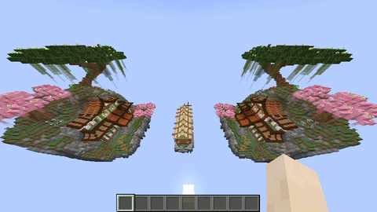

The next steps are self-explanatory.

Place spawners with the spawner item.

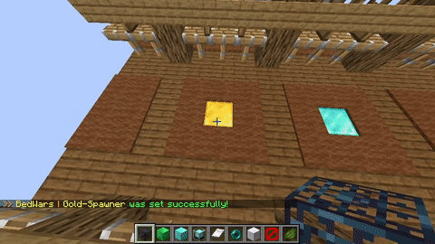

If a spawner was misplaced by accident, it can be remove by punching it once.

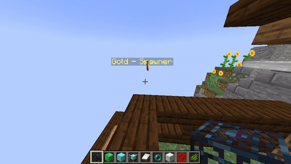

As part of a base, set a player spawn point.

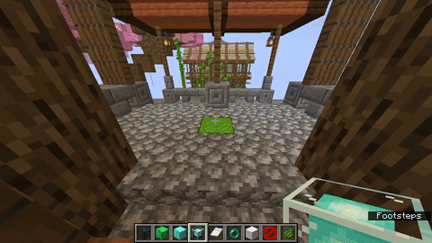

Set an item shop and optionally also a team shop.

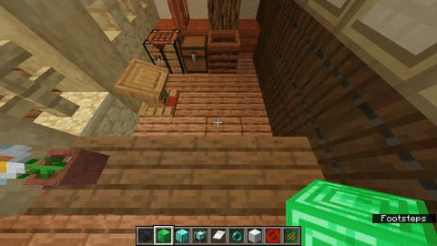

Set a team bed.

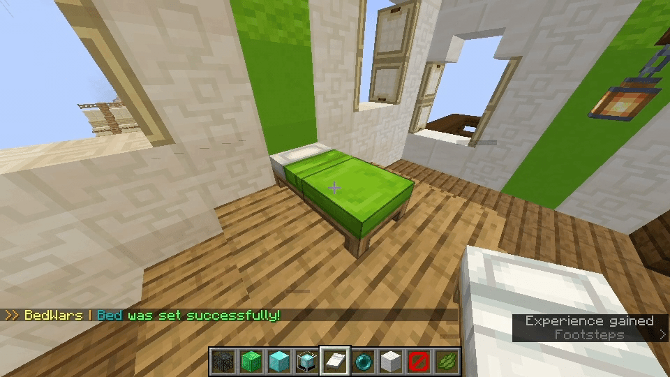

Create a base when done setting it up.

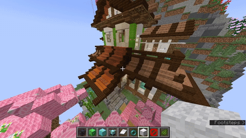

Repeat this for every base.

Additionally a spectator spawn can be set.

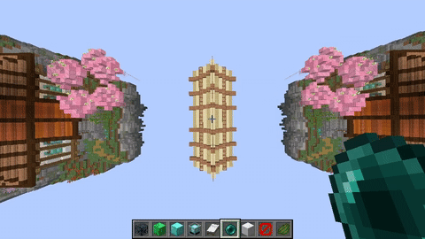

When done setting up the arena, finish the setup.

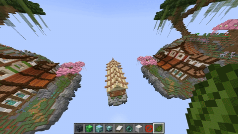

The `/bw listarenas` command lists all of the arenas.

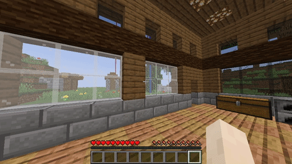

The Bedwars plugin also has join signs.

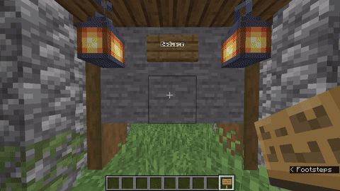

Building the Bedwars Plugin
---------------------------

```console
./gradlew build
```

Running the plugin on an integrated dev server
----------------------------------------------

```console
./gradlew runServer
```
